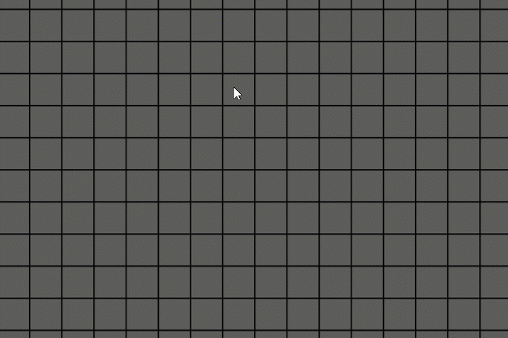

# Minesweeper in Javascript

## Summary

The old classic time-waster, now remade to work in browsers!

## How to Install
- Just clone or download the files. You can use variety of ways to host the website locally.
- I use live server from VS Code.

## How to play
- Click on a tile to reveal it. If it's a bomb, you lose!
- If it's not a bomb, the tile will show how many bombs are in its immediate vicinity.
- Right click on a tile to plant a flag. Flagged tiles are safe to click and make remembering bombs trivial.
- If a numbered tile has right amount of flags around it, you can press on the number to reveal the vicinity. This is called chording.
- If all non-bomb tiles are revealed, you win!